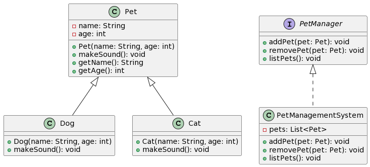

# Pet Management System

This is a Java program that demonstrates a simple pet management system. It includes the following classes:

- `Pet`: An abstract class representing a pet, with properties like name and age, and an abstract method to make a sound.
- `Dog` and `Cat`: Concrete classes that extend the `Pet` class and implement the `makeSound` method for dogs and cats.
- `PetManager`: An interface for managing pets, with methods to add, remove, and list pets.
- `PetManagementSystem`: A class that implements the `PetManager` interface and provides functionality to manage a list of pets.

## Usage

To run the program, compile all the Java files and execute the `Main` class, which serves as the entry point:

## UML Diagram

 
