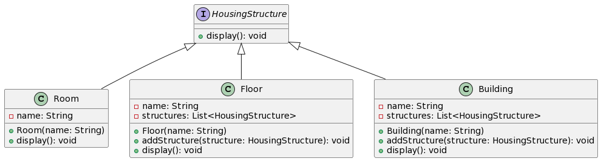

# Code Explanation

## Component Interface

`HousingStructure` is the component interface that declares the `display` method, which is implemented by both leaf and composite classes.

## Leaf Class
`Room` is a leaf class representing individual rooms. It has a `name` and implements the `display` method to print room information.

## Composite Classes
`Floor` and `Building` are composite classes representing parts of the building.
Both `Floor` and `Building` can contain a list of 'HousingStructure' objects.
They implement the `display` method to display their own information along with the information of their contained structures recursively.

## Usage
In the `main` method, we create instances of rooms, floors, and a building, and then add rooms and floors to the building to create a hierarchical structure. Finally, we call the `display` method on the building, which recursively displays the entire structure of the building.

## UML Diagram

 
